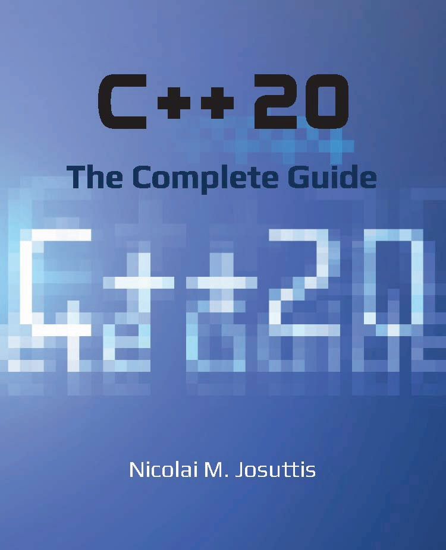

# C++20 - The Complete Guide

 

* 作者：Nicolai M. Josuttis
* 译者：陈晓伟
* 版本：2022-10-30

> 翻译是译者用自己的思想，换一种语言，对原作者想法的重新阐释。鉴于我的学识所限，误解和错译在所难免。如果你能买到本书的原版，且有能力阅读英文，请直接去读原文。因为与之相较，我的译文可能根本不值得一读。
>
> 
 — 云风，程序员修炼之道第2版译者

## 本书概述

C++20的所有新语言和库特性(对于那些了解之前C++以前版本的人)。

C++20是现代C++编程的下一代发展，现在主要的C++编译器g++、Clang和Visual C++都支持，C++20带来的改变巨大。它将比C++11更显著地改变我们的编程方式。像往常一样，并不是所有的东西都是不言自明的，提供新功能会提供更强大的功能的同事，也会有隐藏的陷阱。所以，关键问题是这新的东西在实践到底怎么样。

本书涵盖了C++20所有新特性的动机和上下文(包括语言和库)，为应用程序程序员和库开发人员提供了许多示例和背景信息。重点是这些特性如何影响日常编程，结合这些特性会产生什么效果，以及在实践中如何使用它们。

#### 关键特性

本书主要讨论了C++20引入的对C++的更改。这既适用于语言和库特性，也适用于影响日常应用程序编程的特性和复杂的(基础)库实现的特性，而更一般的情况和例子通常需要首先去了解。

不同的章节进行了分组，这里会先介绍可能会在后面章节会使用的功能。不过，读者们可以按任何顺序阅读这些章节。若将不同章节的特征组合在一起，就会有相应的交叉引用。

## 适读人群

要从本书中获得最大的收获，应该已经熟悉C++。应该熟悉类和引用，并且应该能够使用C++标准库的组件(如IOStreams和容器)编写C++代码。还应该熟悉现代C++的基本特性，例如auto或基于范围的for循环，以及C++11、C++14和C++17引入的特性。

但不必成为专家，本书的目标是让普通C++程序员能够理解这些内容，因为他们不一定知道所有的细节或所有的最新特性。我将在这讨论基本特性，并在需要时回顾更微妙的问题。

这确保了专家级和中级程序员都可以理解本书中的内容。

## 作者简介

[Nicolai Josuttis](http://www.josuttis.com)在编程界很有名，因为他的发言和著作都很有权威，还是世界范围内畅销书的(共同)作者：

* 《The C++ Standard Library》

* 《C++ Templates》

* 《C++ Move Semantics》

* 《C++17》

* 《SOA in Practice》

同时也是一位富有创新精神的演讲者，曾在各种会议和活动中发言。还是独立的讲师，并且在C++标准化方面有20多年的经验。

## 本书相关

* Github地址：https://github.com/xiaoweiChen/CXX20-The-Complete-Guide
* 译文的LaTeX 环境配置：https://www.cnblogs.com/1625--H/p/11524968.html 
  * 禁用拼写检查：https://blog.csdn.net/weixin_39278265/article/details/87931348
  * 使用xelatex编译时需要添加`-shell-escape`和`-8bit`选项
* vscode中配置LaTeX：https://blog.csdn.net/Ruins_LEE/article/details/123555016

